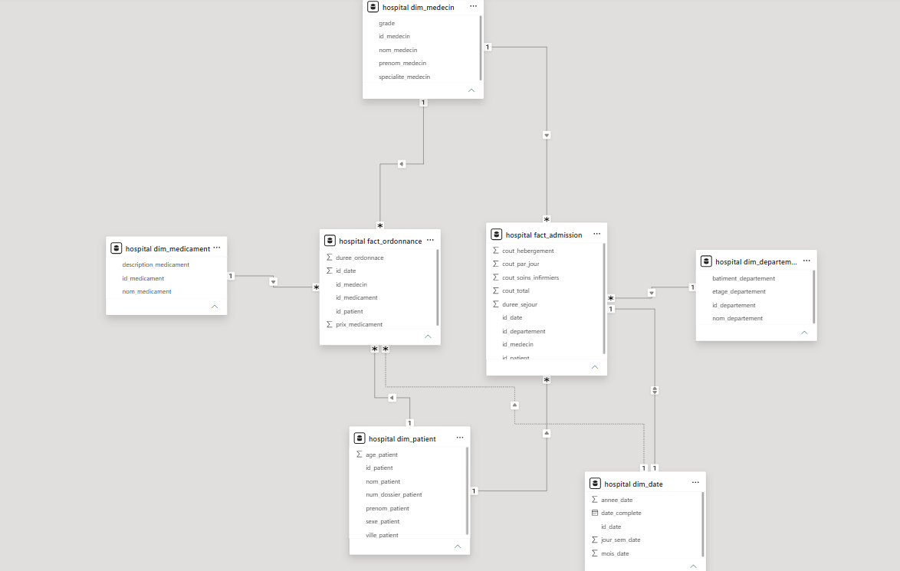
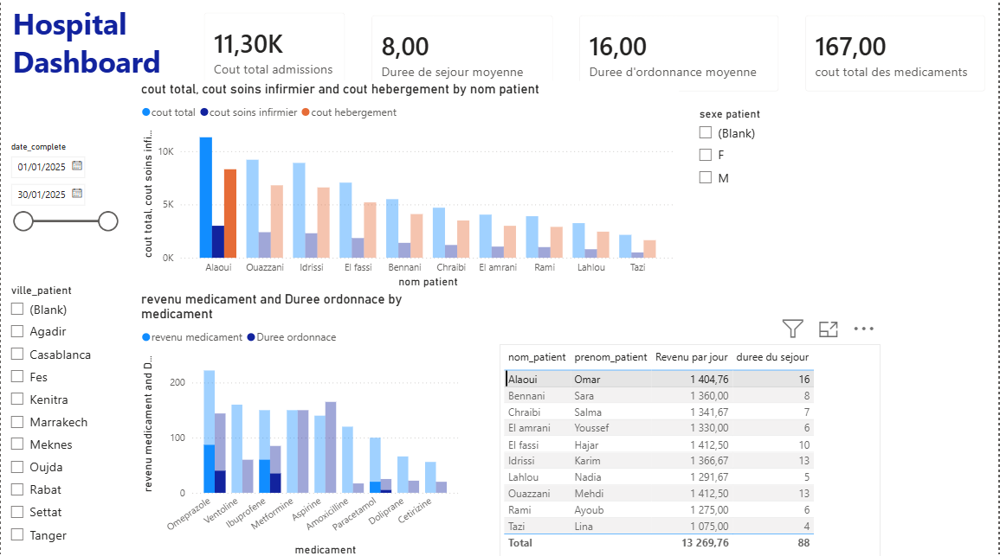
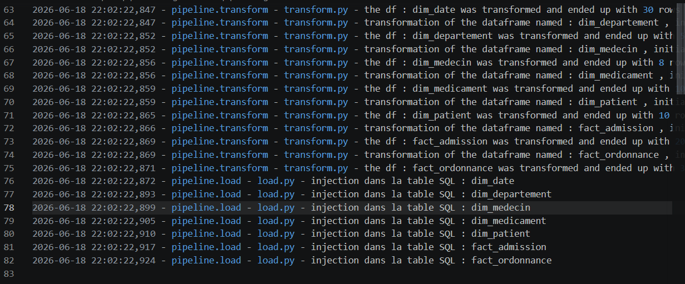

# 🏥 Hospital Data Pipeline (ETL) & Analytics Dashboard

## 📌 Présentation du Projet
Ce projet implémente un pipeline ETL (Extract, Transform, Load) complet conçu pour centraliser, nettoyer et analyser les données opérationnelles et financières d'un établissement hospitalier. 

L'objectif principal est de transformer des données brutes (fichiers CSV) en un entrepôt de données relationnel structuré en étoile (MySQL), afin d'alimenter un tableau de bord décisionnel (Power BI) interactif et dynamique destiné à la direction de l'hôpital.

---

## 🛠️ Stack Technique
* **Langage :** Python 3.11+
* **Traitement de données :** Pandas
* **Base de données :** MySQL (Modélisation via MySQL Workbench)
* **Connexion & ORM :** SQLAlchemy, PyMySQL
* **Visualisation & BI :** Power BI Desktop
* **Gestion de l'environnement :** Python-dotenv (Sécurisation des identifiants de connexion)
* **Observabilité :** Logging (Suivi complet du cycle de vie et traçabilité du pipeline)

---

## 🏗️ Architecture du Projet & Workflow
Le projet est entièrement modulaire et structuré selon les meilleures pratiques de développement :

```text
Hospital_pipeline/
├── data/               # Fichiers CSV sources (données brutes)
├── database/           # Scripts SQL, schéma d'architecture et modèle physique
├── logs/               # Fichiers de logs générés et configuration du logger
├── pipeline/           # Modules du pipeline ETL (extract.py, transform.py, load.py)
├── queries/            # Requêtes SQL analytiques (KPIs)
├── .env                # Variables d'environnement (exclus du versioning)
├── .gitignore          # Fichiers à ignorer par Git
└── main.py             # Point d'entrée unique du pipeline
```

## 🔄 Workflow ETL

1. **Extraction**
Lecture des fichiers CSV (patients, médecins, admissions, etc.)
Chargement en DataFrames Pandas

2. **Transformation**
Nettoyage des données (NULL, doublons)
Normalisation des formats (dates, types numériques)
Structuration en modèle analytique

3. **Chargement**
Insertion dans MySQL
Respect des clés primaires et étrangères
Construction d’un schéma relationnel optimisé

## 🗃️ Modélisation de l'Entrepôt (Schéma en Étoile)

Afin d'optimiser les performances des requêtes analytiques et faciliter l'intégration dans Power BI, les données ont été modélisées selon un Schéma en Étoile (Star Schema).

1. **Tables de Faits** :

**fact_admission :** Analyse des séjours, durées d'hospitalisation et coûts associés (hébergement, soins).

**fact_ordonnance :** Suivi des prescriptions médicales et des revenus pharmaceutiques.

**Tables de Dimensions :**

**dim_patient :** Profils démographiques et géographiques des patients.

**dim_medecin :** Équipes médicales et spécialités.

**dim_medicament :** Catalogue des traitements disponibles.

**dim_departement :** Organisation des services hospitaliers.

**dim_date :** Axe temporel permettant l'analyse chronologique.



## 📈 Restitution Analytics & KPIs (Power BI)
L'entrepôt MySQL est connecté en direct à Power BI pour piloter l'activité de l'établissement à travers 3 axes analytiques majeurs :

**Axe Opérationnel :** Suivi du volume total des admissions et de la Durée Moyenne de Séjour (DMS) par département pour optimiser la gestion des lits.

**Axe Financier :** Analyse du Chiffre d'Affaires global, répartition des coûts (soins vs hébergement) et top des dépenses en médicaments.

**Axe Démographique :** Analyse de la patientèle par ville et par sexe (avec filtres dynamiques) afin d'adapter les ressources de l'établissement.



## 📜 Traces d'Exécution & Logs (Observabilité)
Le pipeline intègre une gestion robuste des logs permettant de suivre le succès de chaque étape (Extract, Transform, Load) et de faciliter le debugging en production.

Exemple de Run Nominal Terminant avec Succès


## 🚀 Installation et Lancement
1. **Prérequis**
Un serveur MySQL actif.

Python 3.11+ installé.

2. Installation
```bash
git clone https://github.com/Fadl-prog/HOSPITAL_ETL_PIPELINE
cd Hospital_pipeline
pip install -r requirements.txt
```
3. Configuration .env
DB_USER=votre_user
DB_PASSWORD=votre_password
DB_HOST=localhost
DB_PORT=3306
DB_NAME=hospital
4. Lancement du pipeline
```bash
python main.py
```